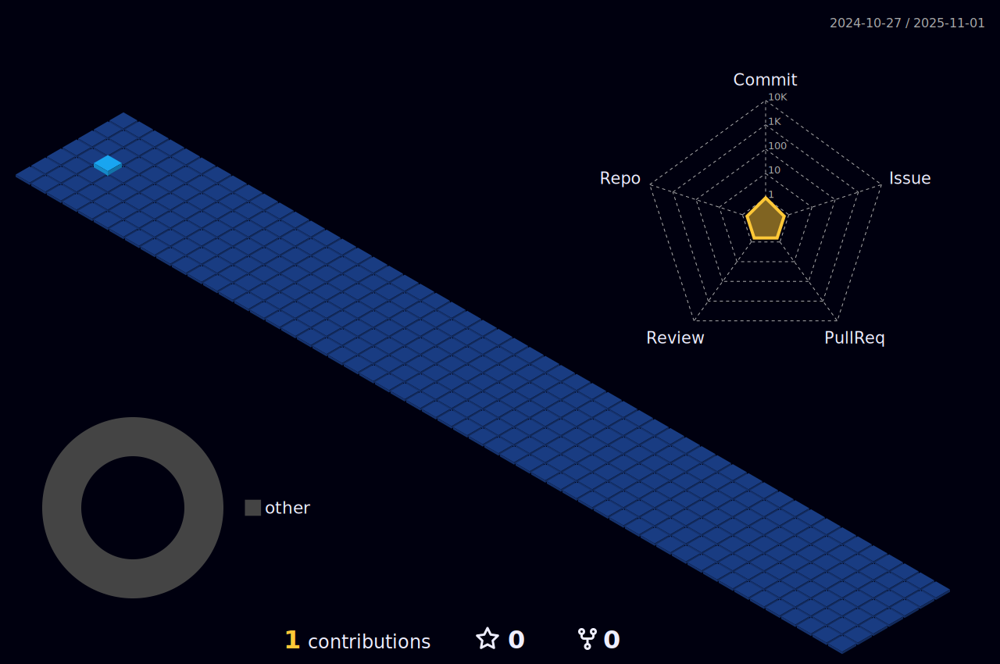

  

<h1 align="center">Hi, I'm <i>Griseliz Ramos Crespo:gem:</i></h1>
<ul>
 
<h2 👩‍💻 align="left"> About Me </h2>
<h4> 👀 I’m interested in books, music, food </h4>
<h4>🌱 I’m currently working on projects </h4>
<h4> 💞️ I’m looking to collaborate on the tech world and make an impact in my life before the rest of the world</h4>
</ul>
<h2 align="center">:stars: A future female Software Engineer :stars:</h2>

  

<h1 align="center">:computer:Current Stats</h1>

&nbsp;

 

<h3 align="left">Languages and Tools:</h3>

 

 <h3> Resume </h3>
 
<a href ="https://github.com/griselizr/Resume/blob/4c5be97efe49f1a54636ceaf919791726e974967/GriselizResume.pdf" </a>
  

